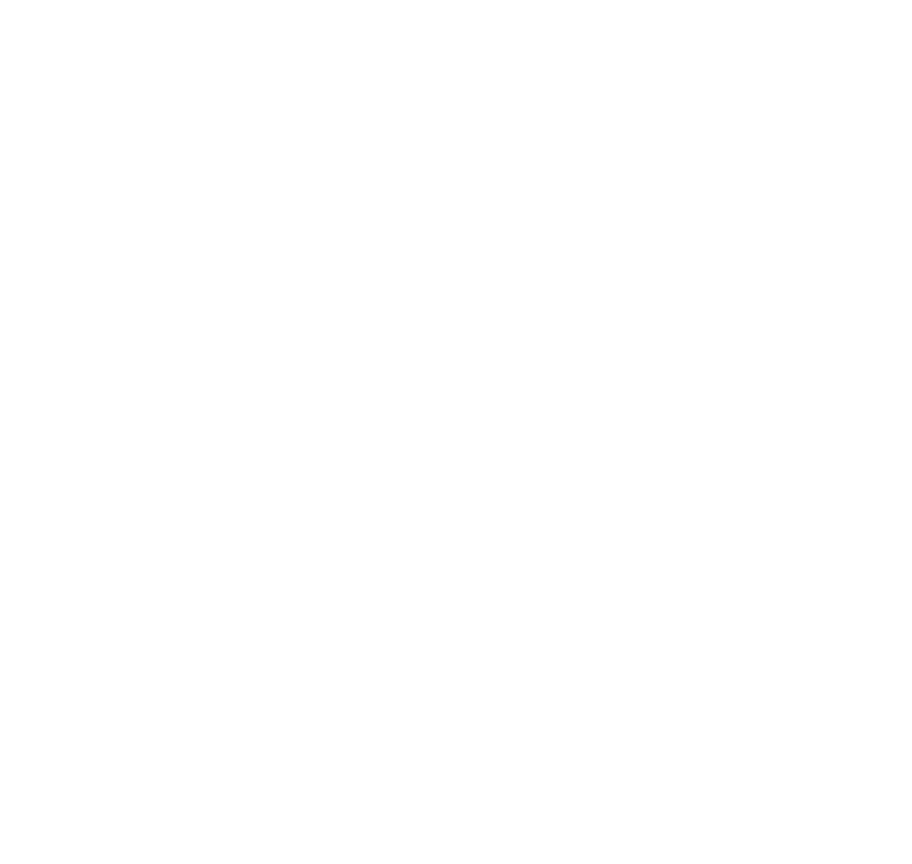

  <!-- Replace with your actual logo URL -->
  <!-- Minimalist or abstract logos work well -->
  
  

      EFFICIENCY. REDEFINED.
  

  

<h3 align="center"><code>1</code> core systems</h3>

  <!-- Replace with links to your key repositories -->
  <a href="https://github.com/crisp-sh/landing">LANDING</a> |
  <a href="https://github.com/crisp-sh/openwebui">ONLYPROMPT</a> |
  <a href="https://github.com/crisp-sh/mcpo">MCPO</a> |
  <a href="https://github.com/crisp-sh/pipelines">PIPELINES</a> |
  <a href="https://github.com/crisp-sh/functions">FUNCTIONS</a>
   
  Actively monitored structures and protocols.

  

<h3 align="center"><code>2</code> contributions</h3>

  
   
  OPERATIONAL CADENCE

  

<h3 align="center"><code>3</code> listen</h3>

  

  

  Inquiries are processed via designated channels.
   
  <!-- Replace with your preferred contact method: Issues, a specific repo, email link, etc. -->
  [ <a href="https://github.com/crisp-sh/.github-public/issues"> Contact Protocol </a> ]

 
 

  Copyright © 2025 crisp.sh. All rights reserved.

